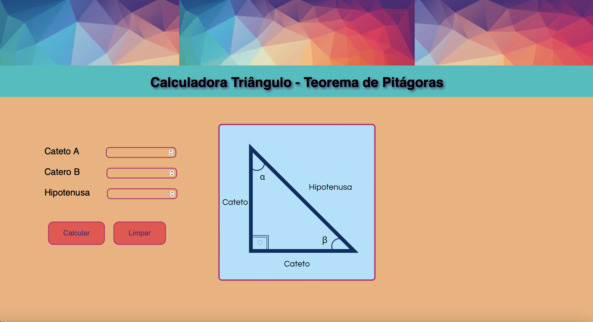

## Badges

## Índice 

* [Título](#Título)
* [Badges](#Badges)
* [Índice](#Índice)
* [Descrição do Projeto](#Descrição)
* [Status do Projeto](#Status)
* [Funcionalidades](#Funcionalidades)
* [Acesso ao Projeto](#Acesso)
* [Tecnologias utilizadas](#Tecnologias)
* [Licença](#licença)
* [Autor](#Autor)

## Título
<h1 text-align="center" >Calculadora - Teorema de Pitágoras</h1>

## Descrição
do Projeto

Projeto desenvolvido para calcular a relação entre os lados de um triângulo retângulo (teorema de Pitágoras). Utilizando HTML5, CSS, TypeScript.

## Status
do Projeto

<h4> :arrow_up: Calculadora do Teorema de Pitágoras :rocket: Finalizado</h4>

## Funcionalidades
do projeto :hammer:

- `Calcula os valores dos lados do triângulo`: com informação de dois valores, podemos calcular o terceiro
- `Calcula os ângulos do triângulo`: a partir dos lados, pode-se calcular os ângulos
- `Calcula a altura do triângulo`: a partir da hipotenusa, pode-se calcular a altura do triângulo
- `Calcula a área do triângulo`: a partir da altura, pode-se calcular a área do triângulo

# Acesso 
ao projeto

<h1 text-align="center">Clique na imagem para utilizar a calculadora.</h1>

<h1 text-align="center">

</h1>

## Tecnologias 
Utilizadas :hammer_and_wrench:

As seguintes ferramentas foram usadas na construção do projeto:

- [VScode](https://code.visualstudio.com)
- [HTML5]
- [CSS3]
- [TypeScript](https://www.typescriptlang.org/)

## Autor

| [ Diego Ailton Prudêncio](https://github.com/DiegoPrudencio) |

## licença

Licenças: MIT License - Copyright (c) 2022 Diego Ailton Prudêncio